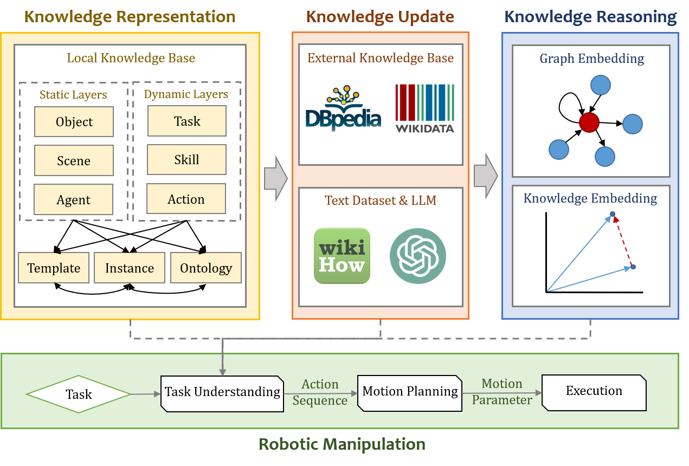

# Hierarchical Representation in Robotic Manipulation: A Knowledge-based Framework

## Kgconstruction
This code is lastly tested with:
* python3.8

How to run
1. First create a folder to store the initial data: "./dataset-v6/demo", ensure that the folder contains an initial triplet file: "dataset-v6-raw-v6.txt"
2. Search DBpedia and run search_dbpedia.py to fetch new triples and new entities based on the data file you specify
3. Obtain the description of all nodes, run get_description.py, and manually correct the node as prompted
4. Integrate all the captured data and run process.py
And create the dataset according to the specified format: "./dataset-v6/demo/ReleaseForTest"
5. Run the split_raw_data.py command to split the data set according to the specified requirements. By default, the data set is divided randomly

## SkillKG
Data files generated during the construction of the dataset, including two searches of DBpedia, and the final version of SkillKG(triples: 11074) / SkillKG-meta(triples: 13154).
### Relations in The Knowledge Graph Dataset
| Relation | Definition | Example |
| :-----| :---- | :---- |
| subject | Subject of action | wipe.a : human.i |
| object | Object of action | throw.a : napkin.o |
| from | The action object is from the target object | pick_up.a : floor.o |
| into | The action object enters the target object | put.a : bottle.o |
| next | The sequence of actions | place.a : stir.a |
| contain | The actions that the task contains | Wipe_The_Dishwasher.t : wash.a |
| start | The action at the start of the task | Empty_The_Cupboard.t	 : take.a |
| end | The action at the end of the task | Place_A_Mousepad.t : place.a |
| on | The action object is on the target object | place.a : desk.o |
| with | The action depends on the target object | cut.a : knife.o |
| in | The action object is in the target object/scene | put.a : bathroom.l |
| beside | The action object is beside the target object | take.a : pot.o |
| under | The action object is under the target object | place.a : water_tap.o |
| to | The action object targets the target object | move.a : computer.o |
| typeof | Class of object | toothbrush.o : toiletries.o |
| hypernym | Object context | cabbage.o : plant.o |
| ingredient | Object component | noodle.o : leavening_agent.o |
| instanceof | Connect entities with the same name in different modules | place_WGYHfl.a : place.a |

## Embedding
This code is lastly tested with:
* python 3.7.x
* pytorch 1.7.x
* torch_geometric 1.7.x, with torch_scatter 2.0.6 and torch_sparse 0.6.9